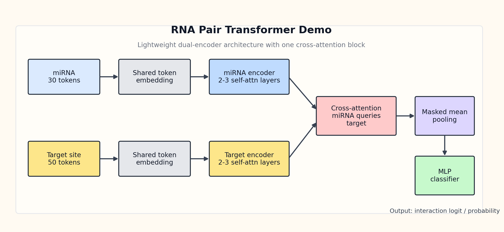
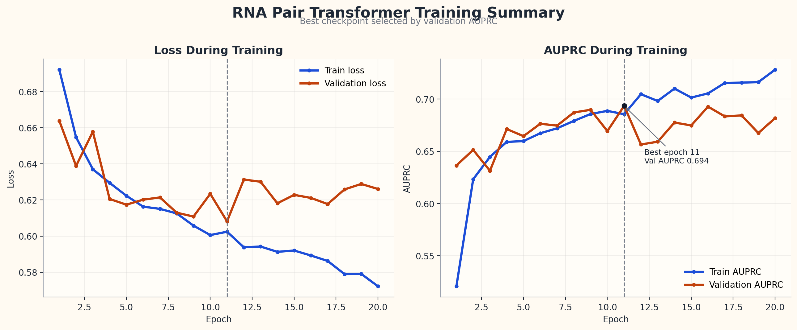
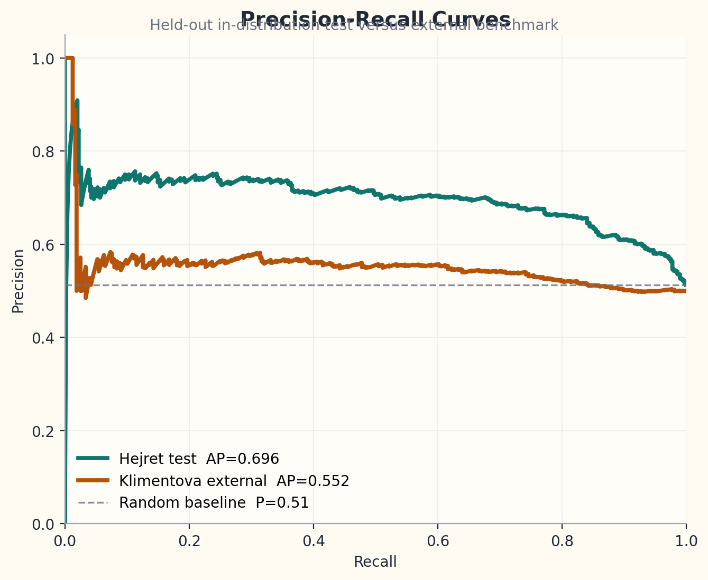
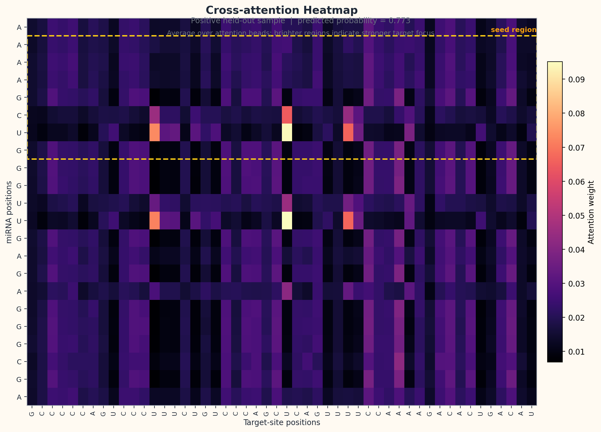

# RNA Pair Transformer Demo

Small, CV-focused demo for `miRNA-mRNA` site-level interaction prediction with a lightweight cross-attention Transformer.

## Overview

This repository implements a compact RNA-aware classification model for `miRNA-mRNA` target-site prediction. The project is designed as a showcase-style demo: small enough to train locally, but structured enough to demonstrate dataset preparation, pairwise Transformer design, evaluation, and attention-based interpretation in one repo.

Core setup:

- Input: one `miRNA sequence` and one `50 nt mRNA target-site window`
- Output: interaction probability
- Tokenization: character-level `A/C/G/U/N`
- Architecture:
  - miRNA encoder
  - target-site encoder
  - one cross-attention block
  - masked pooling
  - MLP classifier

## Why This Project

- It shows explicit Transformer design, not just library usage.
- It fits a two-week demo scope.
- It trains fast enough for short iteration cycles on a consumer GPU.
- It produces interpretable outputs such as cross-attention heatmaps.

## Dataset

This demo uses balanced site-level data derived from `miRBench`:

- Training source: `AGO2_CLASH_Hejret2023`
- In-distribution test: `AGO2_CLASH_Hejret2023`
- External test: `AGO2_eCLIP_Klimentova2022`

Processed files contain only:

- `target_seq`
- `mirna_seq`
- `label`

## Best Run Snapshot

Current main display run: `runs/third_full_train_bigger`

Best validation checkpoint:

- `epoch = 11`
- `best val AUPRC = 0.6935`

Main held-out test metrics:

- `AUPRC = 0.6961`
- `ROC-AUC = 0.7329`
- `F1 = 0.7278`
- `MCC = 0.3847`
- `Accuracy = 0.6891`

Threshold-tuned test metrics using validation-selected threshold `0.49`:

- `F1 = 0.7320`
- `MCC = 0.3908`
- `Accuracy = 0.6912`

External test metrics:

- `AUPRC = 0.5525`
- `ROC-AUC = 0.5619`

Interpretation:

- The model learns useful in-distribution interaction signals on balanced site-level data.
- External performance is lower, which is consistent with dataset shift across experimental sources.
- The demo is intended to showcase model design and interpretability rather than claim state-of-the-art benchmark performance.

## What we are not doing in v1

- No full transcript scanning
- No graph model
- No DNABERT or large pretrained model
- No large benchmark suite
- No long baseline section

## Project structure

- `assets/` figures for README
- `data/raw/` downloaded raw files
- `data/processed/` cleaned datasets
- `docs/` planning and research notes
- `experiments/` configs, logs, and run notes
- `notebooks/` quick analysis and visualization
- `scripts/` data preparation scripts
- `src/` training and model code

## Figures

### Model Diagram



### Training Curves



### Precision-Recall Curves



### Attention Example



The heatmap above shows average cross-attention from miRNA tokens to target-site positions on a held-out positive sample. The highlighted band marks the miRNA seed region.

## Train

Prepare processed data:

```bash
python scripts/prepare_data.py
```

Train a baseline model:

```bash
python -m src.train \
  --run-name baseline_run \
  --epochs 15 \
  --batch-size 64 \
  --learning-rate 1e-3
```

Train the stronger display model:

```bash
python -m src.train \
  --run-name third_full_train_bigger \
  --epochs 20 \
  --batch-size 64 \
  --learning-rate 3e-4 \
  --d-model 96 \
  --num-heads 4 \
  --num-encoder-layers 3 \
  --dim-feedforward 256 \
  --dropout 0.15
```

## Predict

```bash
python -m src.predict \
  --checkpoint runs/third_full_train_bigger/best_model.pt \
  --target-seq AAUUAAAAUGAAUCUUGGCCAGGCGCAGUGGCUCACGCCUCUAAUCCCAG \
  --mirna-seq UUGGAGGCGUGGGUUUU \
  --return-attention
```

## Generate Figures

Training and PR-curve figures:

```bash
python scripts/make_figures.py \
  --run-dir runs/third_full_train_bigger \
  --processed-dir data/processed \
  --output-dir assets
```

Attention heatmap:

```bash
python scripts/make_attention_figure.py \
  --run-dir runs/third_full_train_bigger \
  --split-path data/processed/test.tsv \
  --output-path assets/attention_example.png
```

Model diagram:

```bash
python scripts/make_model_diagram.py \
  --output-path assets/model_diagram.png
```
